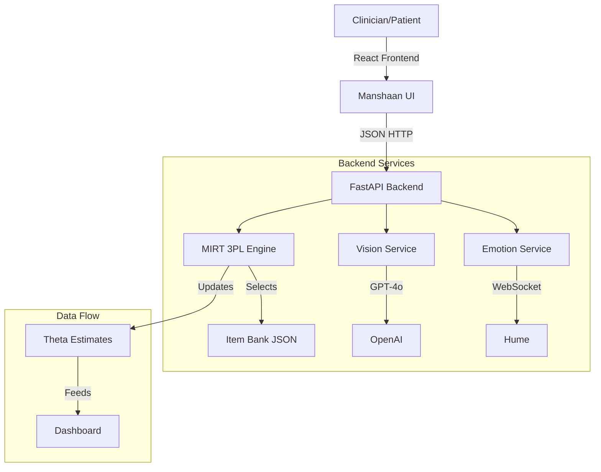

# Manshaan: AI-Assisted Neurodevelopmental Assessment Platform


**Manshaan** is a next-generation research platform designed for the screening of Autism Spectrum Disorder (ASD) and Intellectual Disability (ID). Leveraging **Multidimensional Item Response Theory (MIRT)** and multimodal AI, it delivers adaptive, high-precision cognitive assessments that go beyond traditional static questionnaires.

---

## 🚀 Key Features

### 🧠 Adaptive MIRT Engine
- **3PL Model**: Uses a 3-Parameter Logistic model accounting for difficulty, discrimination, and guessing.
- **Real-Time Estimation**: Expected A Posteriori (EAP) estimation updates ability scores ($\theta$) after every response.
- **5 Cognitive Domains**: Tracks *Episodic Memory*, *Executive Function*, *Working Memory*, *Processing Speed*, and *Visuospatial Skills* simultaneously.
- **Max Information Selection**: Dynamically selects the next item providing the highest Fisher Information for the patient's current estimated ability.

### 👁️ Multimodal Tasks
- **Vision Analysis**: Integrates **GPT-4o Vision** to evaluate drawing tasks (e.g., Beery VMI figure copying, Clock Drawing Test) against clinical scoring criteria.
- **Voice Intelligence**: Integrates **Hume AI EVI** to analyze paralinguistic markers (anxiety, calm, distress) during verbal tasks, generating an "Emotional Resilience" score.

### 📊 Clinical Dashboard
- **Interactive Visualizations**: Radar charts and bar graphs for domain scores (Z-scores/Percentiles).
- **Evidence Transparency**: "Show Evidence" dropdowns for every AI inference, complying with Cures Act "Non-Device CDS" transparency rules.
- **Differential Insight**: AI-generated summary highlighting patterns specific to ASD vs. ID.
- **Clinician Override**: Manual controls to invalidate responses due to external factors (e.g., distraction), triggering instant $\theta$ recalculation.

### 🛡️ Safety & Compliance
- **AB 3030 Ready**: Global disclaimers on all AI-generated content.
- **Non-Diagnostic**: Clear labeling as a "Clinical Insight Report" rather than a diagnosis.

---

## 🛠️ Technology Stack

### Backend
- **Framework**: FastAPI (Python)
- **Math Engine**: NumPy, SciPy (Gaussian quadrature for EAP)
- **AI Services**: OpenAI API (GPT-4o), Google Gemini, Hume AI
- **Testing**: Pytest (Mathematical accuracy validation)

### Frontend
- **Core**: React, TypeScript, Vite
- **Styling**: TailwindCSS (Clinical/Professional theme)
- **State Management**: Zustand
- **Visualization**: Recharts
- **Audio**: Hume Voice SDK

---

## 📦 Installation & Setup

### Prerequisites
- Python 3.9+
- Node.js 18+
- API Keys: OpenAI, Google Gemini, Hume AI

### 1. Backend Setup

```bash
cd backend
python -m venv venv
source venv/bin/activate  # On Windows: venv\Scripts\activate
pip install -r requirements.txt

# Create .env file with your API keys
cp .env.example .env
# Edit .env to add your keys: OPENAI_API_KEY, GOOGLE_API_KEY, HUME_API_KEY
```

Run the backend server:
```bash
uvicorn app.main:app --reload
```
API will be available at `http://localhost:8000`.

### 2. Frontend Setup

```bash
cd frontend
npm install

# Create .env.local file
cp .env.example .env.local
# Edit .env.local to add keys if needed
```

Run the development server:
```bash
npm run dev
```
Application will be available at `http://localhost:5173`.

---

## 🖥️ Usage Guide

1.  **Start Assessment**: Launch the app and enter a Patient ID.
2.  **Adaptive Flow**: Answer questions. The engine will adapt difficulty based on performance.
    *   **Voice Tasks**: Click "Talk Now" to record responses.
    *   **Drawing Tasks**: Use the digital canvas to draw figures.
3.  **View Results**: Upon completion, visit the Dashboard.
    *   Review Domain Scores.
    *   Expand "Evidence" sections to see raw reasoning.
    *   Download the **Clinical Insight Report (PDF)**.
4.  **Simulation Mode**: Visit `/simulation` to watch the IRT algorithm converge in real-time.

---

## 🏗️ Architecture



---

## ⚠️ Medical Disclaimer

**Manshaan is a research prototype.** It is **not** a medical device and does not provide medical diagnoses. All "scores" and "insights" are generated by probabilistic models and AI, which can hallucinate or be biased. Results must be interpreted by a licensed healthcare professional.

---

## 📄 License

MIT License. See [LICENSE](LICENSE) for details.
